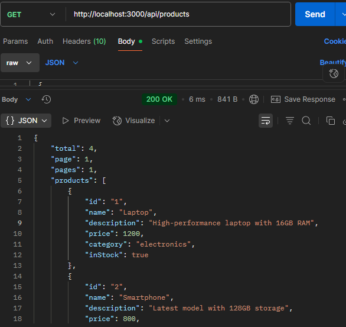
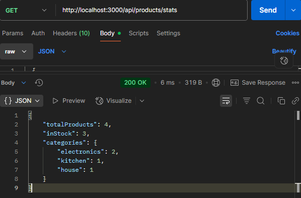
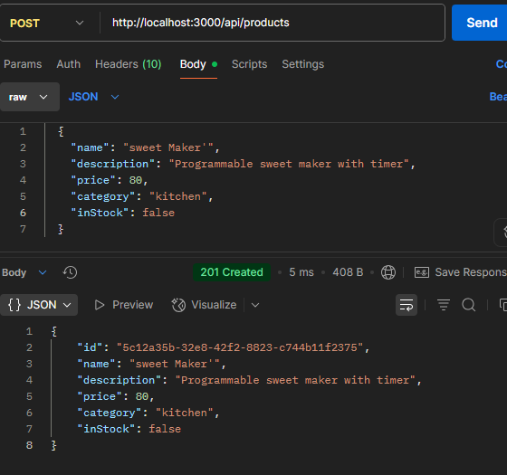

# Product Management API

A RESTful API for managing products with authentication, validation, and advanced features like filtering, pagination, and statistics.

## Table of Contents
- [Installation](#installation)
- [Environment Variables](#environment-variables)
- [API Documentation](#api-documentation)
  - [Authentication](#authentication)
  - [Endpoints](#endpoints)
- [Examples](#examples)
- [Error Handling](#error-handling)

## Installation

1. Clone the repository
 
   git clone https://github.com/PLP-MERN-Stack-Development/week-2-express-js-assignment-MercyAndati.git
   cd week-2-express-js-assignment-MercyAndati

2. install dependenciew
npm install
3. create a .env file based on .env.example
4. start the server
npm start

## Environment Variables

The server uses the following environment variables:

- `PORT` (default: 3000) - The port the server listens on
- `API_KEY` -  secret-API-key for authentication

## API Documentation
### Authentication
all the endpoints require an API key in  the request header:
x-api-key: secret-api-key

### Endpoints
*Products Collection*
GET /api/products - List all products (with filtering, search, pagination)

POST /api/products - Create a new product

*Single Product*
GET /api/products/:id - Get a specific product

PUT /api/products/:id - Update a product

DELETE /api/products/:id - Delete a product

*Statistics*
GET /api/products/stats - Get product statistics

### example

### Error Handling
The API return standardized error responses
*error types*
AuthError (401) - Authentication failed

ValidationError (400) - Invalid request data

NotFoundError (404) - Resource not found

